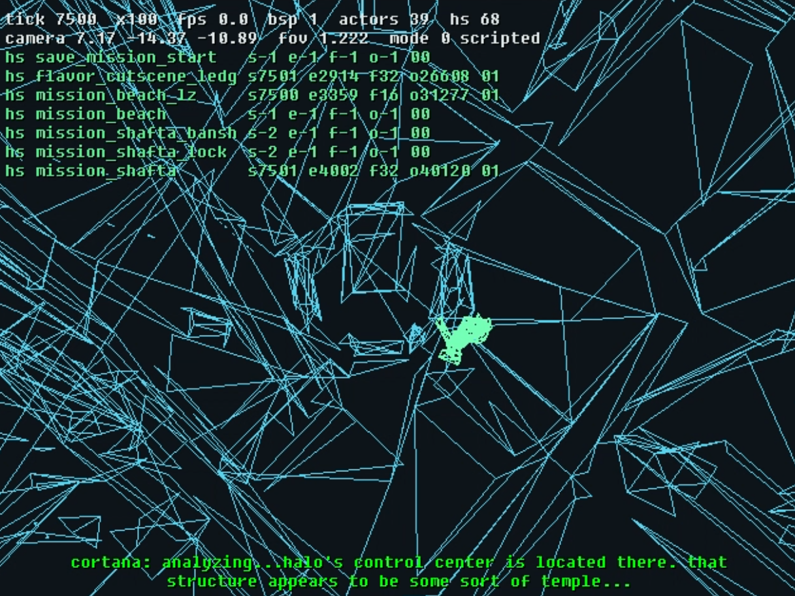

## Legal Notice

Halo: Combat Evolved is owned by **Microsoft / Xbox Game Studios**.

This project is **not affiliated with, endorsed by, or sponsored by Microsoft**.

Microsoft retains all rights to Halo, including the original game and the material from which this research corpus was derived.

This project is not the original works and doesn't contain any original works (such as the original source code) of Halo. There are no game files such as binaries or assets (.map files) in this project.

The project is published in good faith as a research artifact for people who own a legal copy of the game.

**You cannot play Halo with this material. You need a legal copy.**

You can buy a legal copy of halo from Steam or the Microsoft Store:

https://store.steampowered.com/app/976730/Halo_The_Master_Chief_Collection/

https://apps.microsoft.com/collections/curated/halo-pc-games

---

## LLM / Generative AI Notice

For the sake of transparency - this project used generative AI (various Anthropic models). For those who are squeamish of such tools, look away while you can! That said, a human flesh sack was involved in the process when and where it was effective, including the document you are reading now.

---

# Halo: Combat Evolved — HCEA Decompilation Corpus - Blam!

> A symbol rich source corpus for **Halo: Combat Evolved Anniversary (HCEA) for the Xbox 360**, created as a reference for Halo engine research and ongoing decompilation efforts.

**This is a research/decompilation corpus — it is not a playable version of Halo.**

## Context: What is this?

This repository contains a best-effort reconstruction of source code from the **Halo: Combat Evolved Anniversary** Xbox 360 release.

[Halo: Combat Evolved Anniversary (Jun 24, 2011 prototype) - Hidden Palace](https://hiddenpalace.org/Halo:_Combat_Evolved_Anniversary_\(Jun_24,_2011_prototype\))

This prototype of Halo CE Anniversary has _very_ verbose symbols with minimal compile time optimization.

Retail releases of Halo (shipped disks to consumers) have symbols stripped out and heavy code optimisations ran accross them to improve performance which by nature discards the verbosity of what can usually be observed, this prototype has kept all that information.

Symbols are useful for Halo decompliation efforts as we get developer named variables (and associated data, structs, ...) which give us clearer code intention rather than just looking at the behaviour.

Prototype information:

* **Binary:** `HCEX_Release.xex`
* **HCEA / Saber Engine:** `0.0.83147`
* **HCE / Blam! Engine:** `01.00.01.0563`
* **Platform:** Xbox 360 / PowerPC

reclaimers.net has flow chart of `Blam!` engine variants over releases:
[Halo 1 - c20](https://c20.reclaimers.net/h1/)

This corpus is the result of pulling out all the static library information, symbols, types, etc, into something useful.

`Blam!` (Halo CE engine) was the target, the entire `Blam!` engine library is actually statically linked in so even functions that the runtime game engine doesn't call during gameplay were compiled in, everything Blam! has been re-sourced. There were some toolkit calls and `#ifdefs` that ended up no-opíng a few functions calls however.

Havok and some Xbox360 libraries were only partially re-sourced. I only re-sourced what I needed to complete edges so I could compile TUs. The Havok framework statically linked here is in excess of 12,000 functions.

Saber's HCEA management engine system has been re-sourced.

Saber's entire engine code (Halo CEA doesn't use the full engine) is statically linked in this binary, I pulled a bit more of the AI system out during my tests but it's out of scope for this project. All of the Saber sub systems Halo CEA uses are re-sourced completely.

---

## Scope / Intents

The goal was not to produce a byte-perfect recompilation. If you compile this source, you won't get the exact dissassembly of Bungies `Blam!`. 

Achieiving that milestone is in-scope for the projects listed below.

It's still going to be `Blam!` and Halo.

This corpus was created with **LLM-assisted reverse engineering** in mind. Hence all of the Blam! code is sitting in the root of the /src folder.

As of Aug 2026, there are several campaigns underway to achieve byte-level accuracy for the OG Xbox versions of Halo CE.

This project was intended to help enlighten those projects if variable names were not able to be recovered from thier own retail binaries.

* https://github.com/halo-re/halo (join the Discord of this project, all of the project contributors of various halo decomp projects are in here)

* https://github.com/stianeklund/halo/
* https://github.com/bnunu/halo/tree/jonas/exact-pilots
* https://github.com/punpckhdq/halo
* https://github.com/Aerocatia/demon

There are several other in-flight `Blam!` engine research projects I'm also aware of but the list would be huge. I hope this project is useful to all of them.

## Human readable documentation

A generated documentation site is available for those who would rather explore the recovered engine through documentation than directly through the source tree. LLM alert, this was generated with a Fable 5 model on Max reasoning, results may vary!

`https://surreptitiousresearch.github.io/halocea_docs/`

The AI subsystem currently contains some of the deepest documentation, as it's something I wanted to deeply understand.

The source is human readable so you're welcome to browse away and learn more about `Blam!` and Halo CE!

Significant effort was put into the symbol recovery, the source should be very verbose with symbols and a minimal amount of magicnumbers.

## Other information:

One of the main outcomes I wanted behind this repository was determining how effective modern frontier models could assist with reconstructing a large and complex binary with .PDB data. I have lots of lessons learned - they are very effective but cannot be left to thier own devices, they need to be guided. I used various tooling such as remill, LLVM and other instrumentation tooling during this project.

A variety of Anthropic models at different effort levels were used throughout the process, including:

* Haiku 4.5
* Sonnet 5
* Opus 4.8
* Opus 5
* Fable 5

You might notice some different styles of coding going between each function, this is why.

The bulk of the project took approximately five weeks on and off so far, work is on-going.

When and where possible, inline functions were unrolled back into function calls, the source is attempting to resemble what Bungie developers were working with. 

That said, the C macro style is not what Bungie were using, this is a design choice I made to fast track some token/scripting optimizers. See `bungie_datum_access.c` on how Bungie set up thier C styling.

There are none of my own optimization's in the source code, all re-constructions have a concrete reference to the .xex data, your LLM should be able to find its way through the source and correlate the hard evidence quickly. Hence the structs are quite verbose with IDAs anon unions.

Wishing everyone the best with their own decompile efforts, I'm quite excited to see the original Halo CE source for Xbox and other Halo games.

## Attribution

Special thanks to [**idasql**](https://github.com/allthingsida/idasql) for the tooling that did much of the heavy lifting involved in extracting and working with the binary information.

Contributors:

* **Jojo** (`.lolcat`) — bug reports and `silentc_wireframe_cine.png`

You do not need to credit this repository or me if you use the material as a research reference. I'm just a New Zealander banging a hammer around.

---

[Eric Trautmann: "The “117” reference](https://web.archive.org/web/20201112031126/https://twitter.com/mercuryeric/status/883833638701355008)
John 117 -> Revelation 1:17

"When I saw him, I fell at his feet as though dead. Then he placed his right hand on me and said: “Do not be afraid. I am the First and the Last."

Jesus Christ is the Lord, God Bless to whomever reads this.